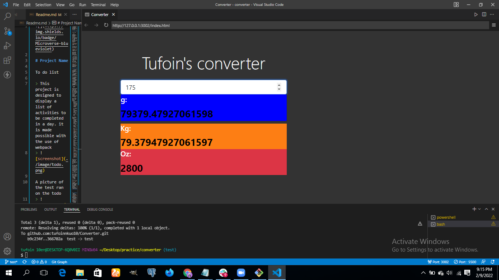

# Project Name

To do list

> This project is designed to calculate and convert pounds to kg,g and Oz .


> 


[Live Link](https://tufoinnkuo10.github.io/Converter/)

## Built With

- 
- 
-  
- 
- 
- barbel
- jest

##periquities
To get this project up and running, you should do the following;
If you wish to run the project locally, please do the following:

1.- Install Node.js and npm if you haven't already.
   To install Node.js, follow the instructions on [Node.js](https://nodejs.org/en/).
   
   To install npm, run the following command in your terminal:
   ``` bash
   npm install -g npm
   ```
2.- Install webpack and linters.
   To install webpack, run the following command in your terminal:
   ``` bash
   npm install -g webpack
   ```
   or follow the instructions on [webpack](https://webpack.js.org/).
   To install linters, run the following command in your terminal:
   ``` bash
   npm install -g eslint
   npm install -g stylelint
   npm install -g webhint
   ```
   or follow the instructions on [eslint](https://eslint.org/), [stylelint](https://stylelint.io/), and [webhint](https://webhint.io/).

Also you can clone the repository and most of the jobs will be done for you.

Once you have the setup and the project locally, you can run the project using the following command in your terminal:
``` bash
npm run build
```
and if you want to watch the changes live, run the following command:
``` bash
npm start
```
also you can run ``` npm run watch ``` to make webpack watch the changes and rebuild the project without having to run the build command again.


👤 **Author**
- Name: Tufoin Nkuo
- GitHub: [@tufoinnkuo10](https://github.com/tufoinnkuo10)
- Twitter: [@itztenten](https://twitter.com/itztenten)
- LinkedIn: [LinkedIn](https://www.linkedin.com/in/tufoin-nkuo-3b272320b)

## 🤝 Contributing


Contributions, issues, and feature requests are welcome!

Feel free to check the [issues page](../../issues/).

## Show your support

Give a ⭐️ if you like this project!

## Acknowledgments

- This project is realised thanks to microverse

## 📝 License

This project is [MIT](./LICENSE.md) licensed.